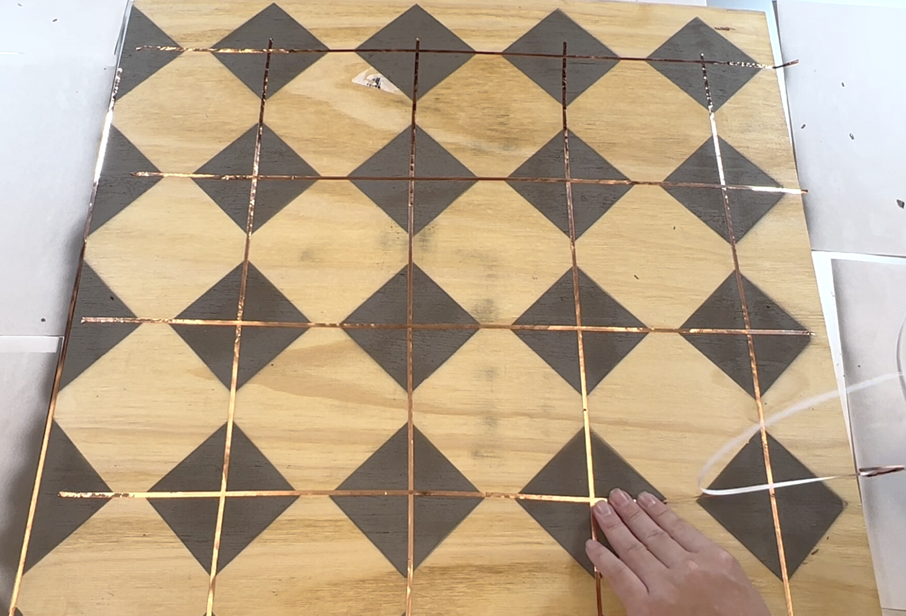
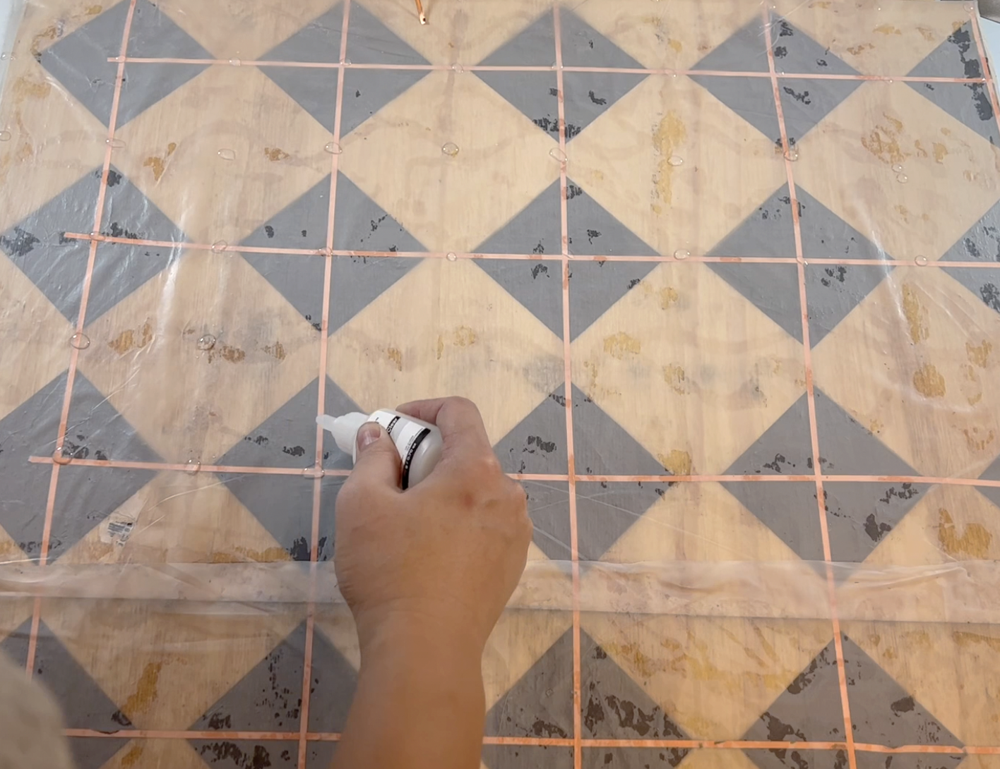

# Hardware of iWood
This page elaborates the process of iWood fabrication, and also includes the examples of making smart item using iWood.
Please carefully follow the below steps for the best performance of iWood.

## Fabricating iWood
iWood is basically a wood-based triboelectric nanogenerator (TENG). It is worthy to note that the following process is intended to be simplified for easy replication of iWood.
The overview of the process is illustrated in [[Video]](https://youtu.be/MELff8HCPHg?t=97). 
The whole process takes at least 2 days.
For safety and health's sake, the following steps should be done in woodworking workshop or a public space.

### Materials

- Four [Analog Discovery](https://a.co/d/8UZeghu)
- Two [1/8 x 24 x 24 inch plywood](https://a.co/d/iPqR0PH) or  [1/2 x 24 x 24 inch plywood](https://www.homedepot.com/p/Handprint-1-4-in-x-2-ft-x-2-ft-Sanded-Plywood-300810/202093828)
- Two [24 x 24 inch acrylic](https://a.co/d/brCa8oK)
- 24 x 24 inch PTFE film or [PTFE roll](https://a.co/d/5RTONVc)
- [Copper tape](https://a.co/d/4Cftsjp)
- [Plastic glue](https://a.co/d/3S82JSe)
- [Plastic glue activator](https://a.co/d/aBmSUQ3)
-  One ore multiple conductive spray([Carbon](https://a.co/d/iR77i8i), [Nickel](https://a.co/d/hQNKQcg), [Silver](https://a.co/d/5PgTTYC)) 
- [Clamps](https://a.co/d/0wzBkBz)
- [Protective mask](https://a.co/d/hiEatmB)
- [48" Heavy-Duty Adjustable Workbench](https://a.co/d/1tXMlNN)(optional)
- [Wool balls](https://a.co/d/3kH88tN)

### Fabrication

#### Step1 Creating an electrode pattern stencil

1. (optional) run electrode pattern generator in PatternGenerator folder if the plywood size is different from 2 feet.

``` 
pip install scipy 
pip install Pillow	
python teng_pattern_generator.py 
```

2. laser-cut out the stencil of top and bottom electrode pattern on two 24 x 24 inch acrylic.

### Step2 Creating the electrodes on the plywood using stencils and conductive spray paint.
1. Check if plywood is not warped or bent. It is important as warped plywood will separate the TENG structure. If plywood is warped, please follow this [instruction](https://theplywood.com/flattening-warped/) to flattern it.
2. Fix the stencil of the top electrode pattern firmly on the plywood using double side tape. 
3. Spray the conductive paint on it, as illustrated below.
4. Repeated same process on the other plywood with the stencil of the bottom electrode pattern.
5. Wait at least 2 hours to make sure the paint well dry.
6. Labelled which plywood is with the top electrode pattern and which plywood is with the bottom electrode pattern.


### Step2 Connect the electrodes in rows and columns using copper tapes.


### Step3 Glue 24 inch x 24 inch PTFE film firmly on the plywood with the bottom electrode pattern.
1. Apply glue activator on the one side of PTFE film.
2. Apply plastic glue on the plywood with the bottom electrode pattern using [sine wave patterns](https://i0.wp.com/hardwoodfloorsmag.com/wp-content/uploads/2020/11/gluepatterns.png?resize=589%2C538&ssl=1)
3. Firmly attached PTFE film (the side that glue activator is applied to) to the plywood.
4. Use wool balls to rub the PTFE film, which will make PTFE film cling to plywood very well due to triboelectric effects.

### Step4 Bond the other plywood to it.
1. Apply glue activator and glue on PTFE film using the point bonding strategy (i.e. the bonding points separated 50mm apart from each other in the x and y directions.)
2. Attach the other plywood to it and use clamps to fix them on the flat workbench.
3. Wait one days to make sure the glue well cured.



### Step5 Use the stencil to mark the access/connection points on the plywood
Please not that to facilitate the later electrical connection, the marked access points of the top and bottom electrodes should be as close as possible.


## Making Smart Things using iWood
iWood can withstand most woodworking operations so diverse smart things can be made using iWood.
Here are the examples of how smart table, nightstand, and cutting board can be made.


### Table
The table consisted of four wooden legs attached to a 1220mm × 610mm × 12.7mm plywood tabletop, which was created using two iWood boards attached side-by-side.

#### Tools and Materials

- Two 1/2inch or 1 inch thick iWood
- [Max Drill & Home Tool Kit](https://a.co/d/b6gZmiJ)
- [Sander](https://a.co/d/84EjKV1) and [Sanding Pads](https://a.co/d/5d0wtur)
- [60 inch Bar Clamps](https://www.harborfreight.com/60-in-aluminum-f-style-bar-clamp-60673.html?utm_source=google&utm_medium=cpc&utm_campaign=17890471891&campaignid=17890471891&utm_content=146321473864&adsetid=146321473864&product=60673&store=&gclid=Cj0KCQjwj7CZBhDHARIsAPPWv3ewYJpY6wVamlKSgkyAdApbYyD1VPTYwRjKL2F4Onukndyx26Ju2aoaAlgBEALw_wcB)
- [Four table lags](https://www.homedepot.com/p/Waddell-WAD2428-2-1-8-in-x-2-1-8-in-x-28-in-Pine-Traditional-Leg-10001528/202528521?)
- [Wood glue](https://a.co/d/1thNf7T)
- [Protective finish spray](https://a.co/d/a6j9l2X)

#### Steps

The tabletop was created using two iWood boards glued and clamped side-by-side (24 hour cured). Each leg came with a pre-installed 8mm hanger bolt so pilot holes were created at the four corners of the tabletop using a drill driver to allow the legs to be mounted To finish the process, the surface of the tabletop was smoothed using sandpaper and coated with protective PU to prevent it from water and warping. 


### Nightstand
The structure of the nightstand was more complicated than the table. It consisted of a top panel made of iWood, a bottom panel, three side panels, four legs, and a drawer. 

#### Tools and Materials

- Two 1/2inch thick iWood
- [Max Drill & Home Tool Kit](https://a.co/d/b6gZmiJ)
- [Jigsaw](https://a.co/d/4tzq35w)
- [Sander](https://a.co/d/84EjKV1) and [Sanding Pads](https://a.co/d/5d0wtur)
- [Wood glue](https://a.co/d/1thNf7T)
- [Espresso wood stain](https://a.co/d/gJiDYvg)
- [Wood stain brushes](https://a.co/d/9qsEuGZ)
- [Wood screws](https://a.co/d/gTcbIOj)
- [other parts](https://www.walmart.com/ip/Mainstays-Hillside-Nightstand-with-Drawer-Espresso-Finish/689698575?athbdg=L1600)

#### Steps

The top panel (500mm × 500mm × 12.7mm) and drawer bottom (310mm × 375mm  × 6.35mm) were created using iWood and a jigsaw. The top panel was attached to the frame and side panels from the corners using four 10mm wood screws. The drawer bottom was fixed to the notch of the drawer sides using glue. We also polished the top panel using sandpaper and painted it in espresso stain to match the color of the rest of the nightstand. 


### Cutting Board
Like regular plywood, iWood can withstand laser cutting. You can create a custom cutting board (400mm × 600mm × 6.35mm), using 3D modeling software and a laser cutter. No additional configuration was needed for the laser cutter and the machine was set to cut a plywood board of 6.35mm thick.


## Connecting to iWood

Screw two [wood screw](https://www.amazon.com/dp/B09ZRS4ZX3?ref_=cm_sw_r_cp_ud_dp_749WP0QV6BJNM8280V73) respectively to the access points of top electrodes and bottom electrodes.

